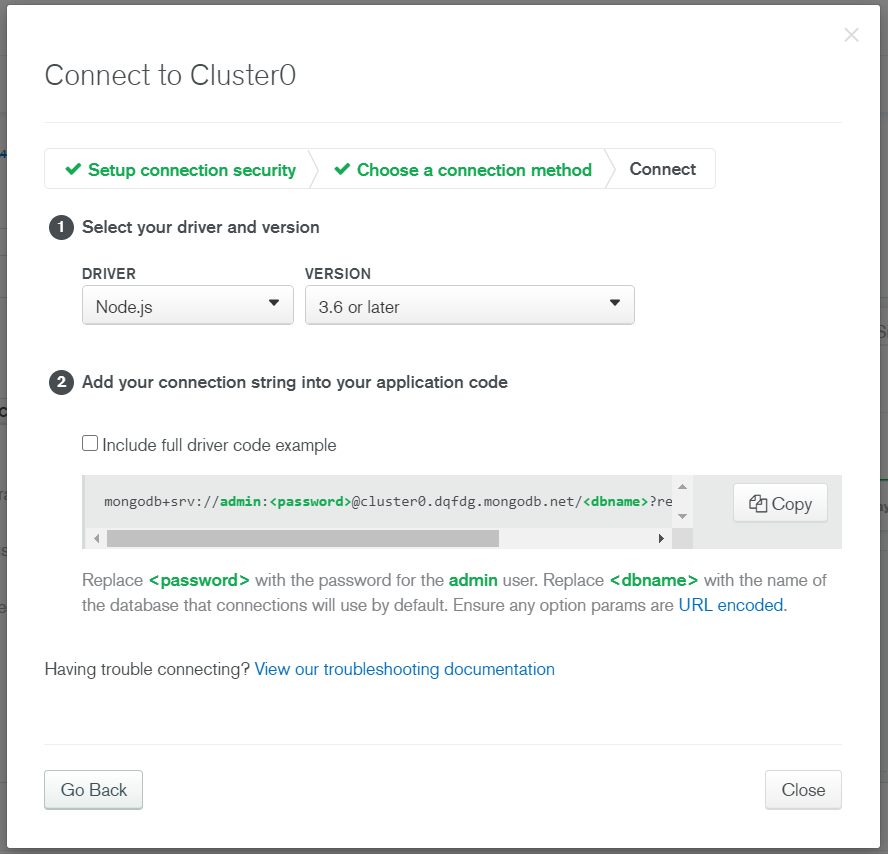
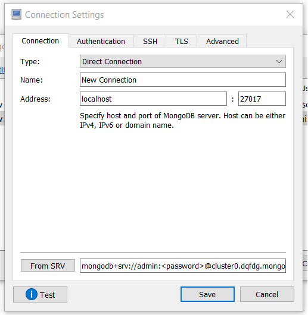
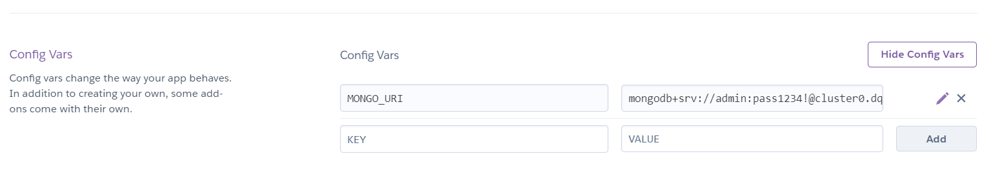

# CBWA-API-CA1
> System developed for a college project aiming to obtain all the knowledge possible in relation to API's using Javascript.

## Table of contents
* [What your project does](#what-your-project-does)
* [How to set it up](#How-to-set-it-up)
* [Technologies used](#technologies-used)
* [Example usage](#example-usage)
* [Changelog](#changelog)
* [Roadmap](#roadmap)
* [Author info](#author-info)

## What your project does
The code is to do with registration and management of a bugtracking system. It is possible to manipulate users, projects, issues and comments for these projects and Everything is stored in a database (MongoDB). When an issue is resolved it is also possible to change the status as long as it is one of the following status:

* Open
* Wip
* Blocked
* Closed

All tables are linked in a way that when an issue or comment is added, information like project ID and user are attached to it.

## How to set it up
Firstly clone the project running the following command
```ruby
$ git clone https://github.com/ferreirajackson/CBWA-API-CA1.git
```

Then install the dependencies used in the project you case you dont have them
```ruby
$ npm install body-parser
$ npm install express
$ npm install mongodb
$ npm install nodemon
$ npm install nodemailer
```
MONGO CONFIGURATION
1. Create and set up a mongo account if you dont have at [Mongo-Atlas](https://www.mongodb.com/cloud/atlas)


2. Create a cluster and get the connection link.


3. Install ROBO3T at [Robo3T](https://robomongo.org/)

4. Configure the database manager with the conection link



5. Run the following variable in our node.js terminal and paste to heroku config vars so you can connect your database with your webpage
$env:MONGO_URI="mongodb+srv://admin:<password>@cluster0.dqfdg.mongodb.net/<dbname>?retryWrites=true&w=majority"
  


## Technologies used
* Nodemon
* Express
* MongoDB
* Robo3T
* Heroku

## Example usage
All the routes can be accessed through [this document](./instructions/REQUESTS_URL.docx)
[This document](./instructions/USAGE_URL.docx) is a guide on how to use the functionalities applied to the project. 

## Changelog
* 9th of October 2020 - Created project for Cloud Based Web Applications subjects.
* 13th of October 2020 - Implemented the following entities: projects, issues, users and comments.
* 22nd of October 2020 - Added all the functions and connection to database: Aggregate, post, get, update and count.
* 9th of November 2020 - Added Error checking and Readme file.
* 12nd of November 2020 - Implemented the nodmailer and watchers.
* 18th of November 2020 - Implemented the frontend.
* 19th of November 2020 - Kept working on the frontend.
* 20th of November 2020 - Implemented the dueDate functionality.
* 25th of November 2020 - Checked if the project was working in a whole.

## Roadmap
* Implement post and put methods to the frontend using handlebars. (Dec 2020)
* Docker-ise it. (Dec 2020)
* Repaginate the frontend with React. (Dec 2020)

## Author info
Web developer: Jackson Ferreira dos Santos | 
College name: CCT | 
Course title: Science in computing


